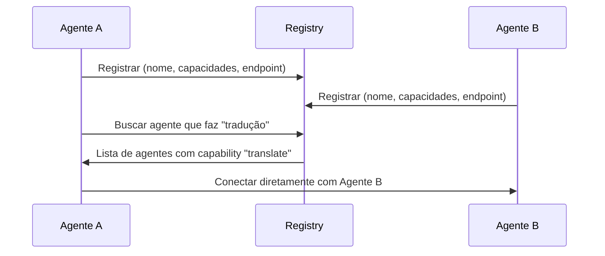
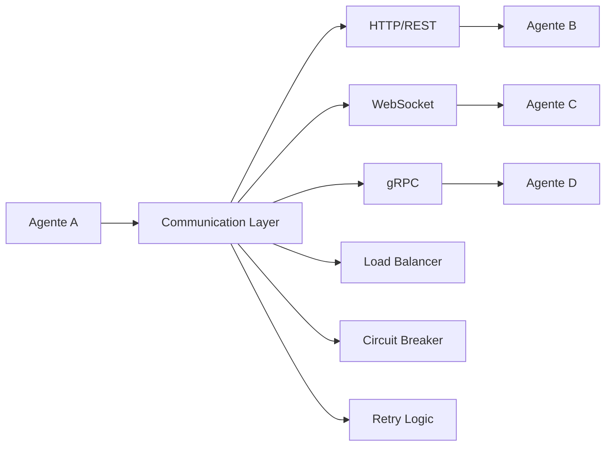
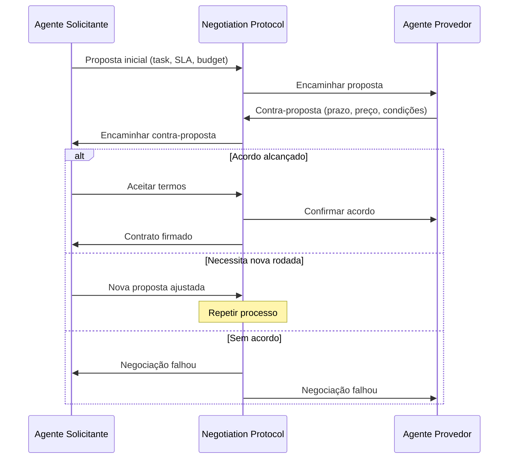
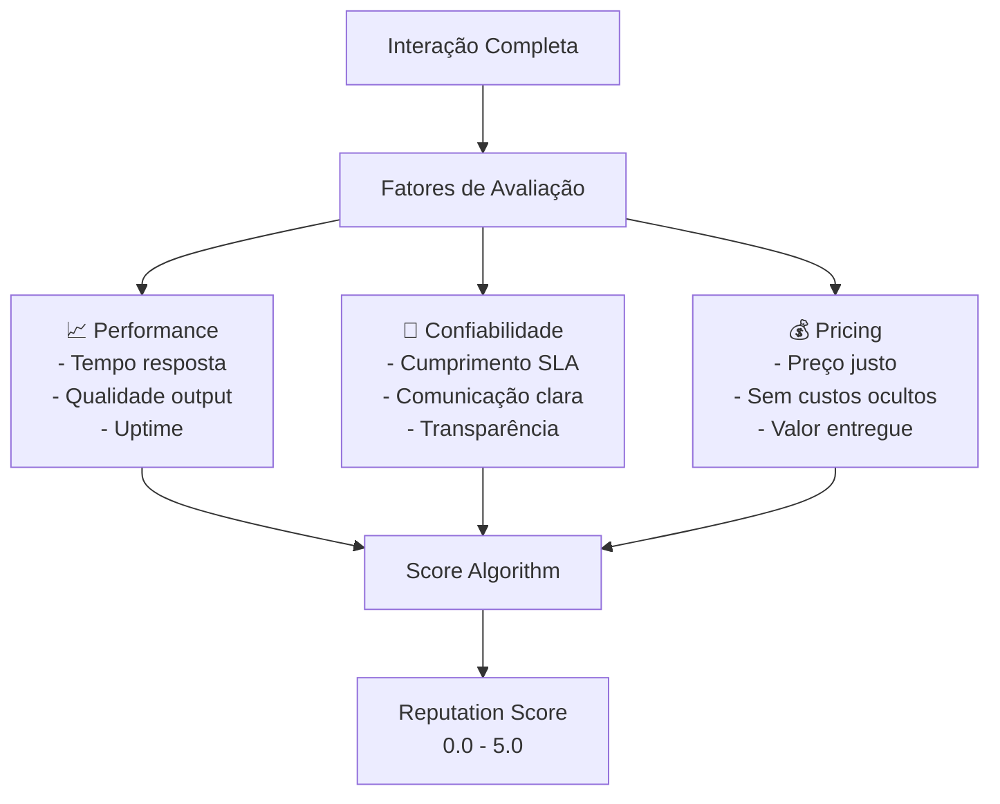
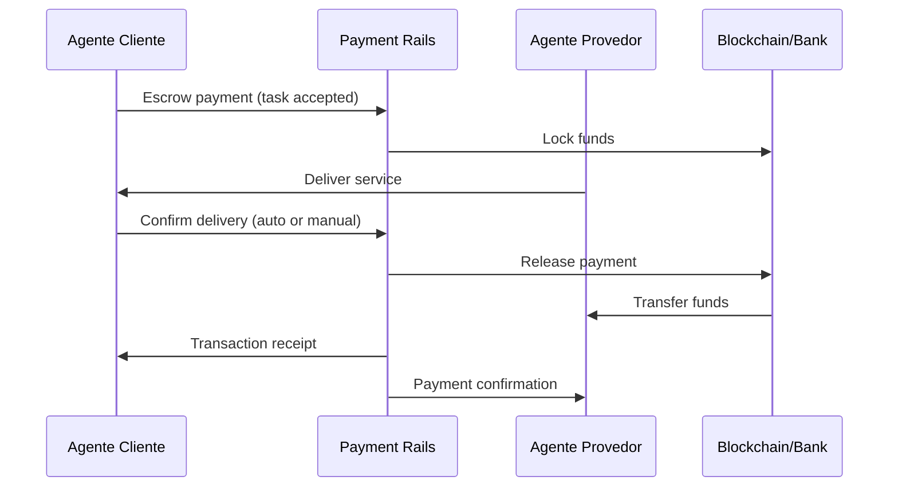
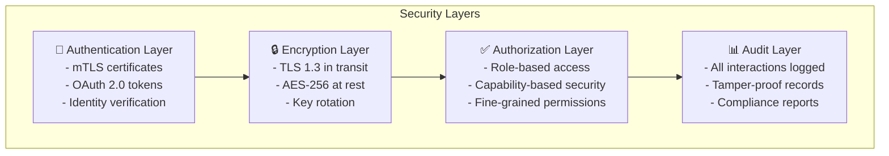
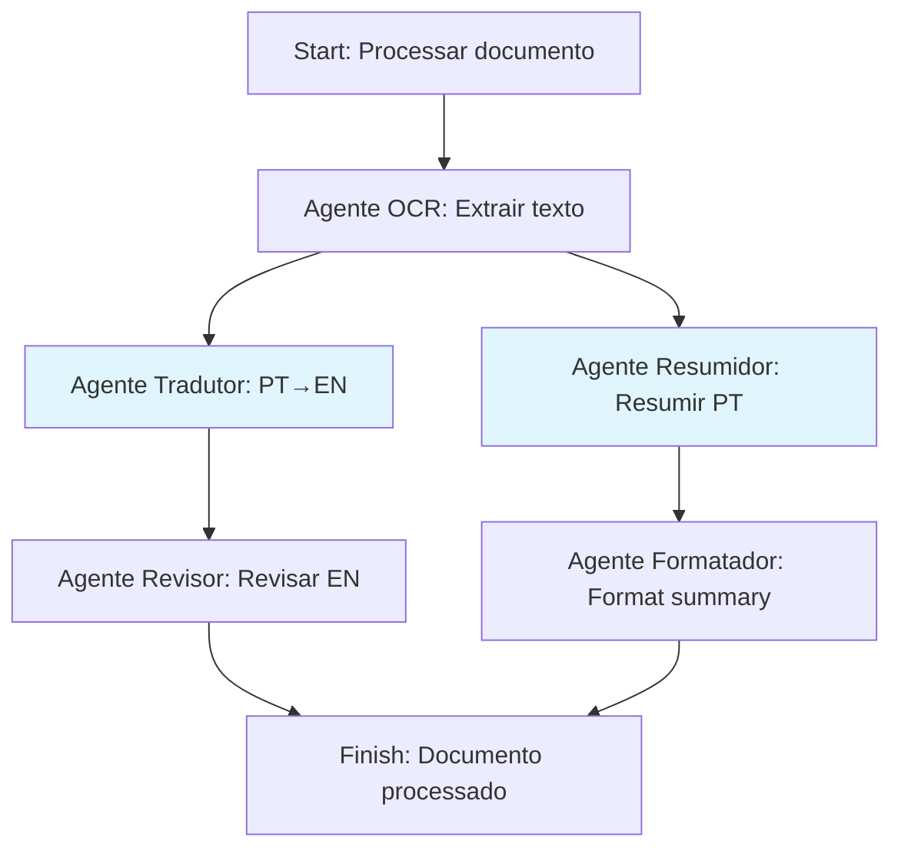
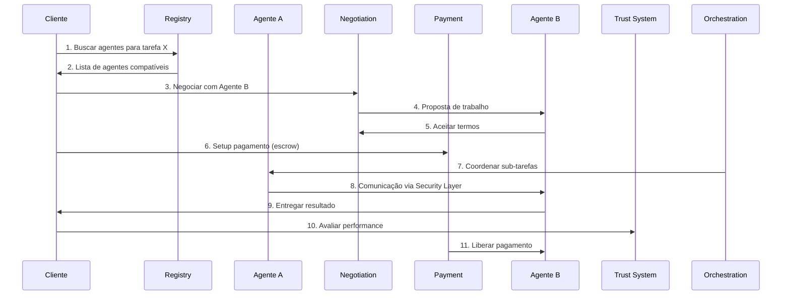
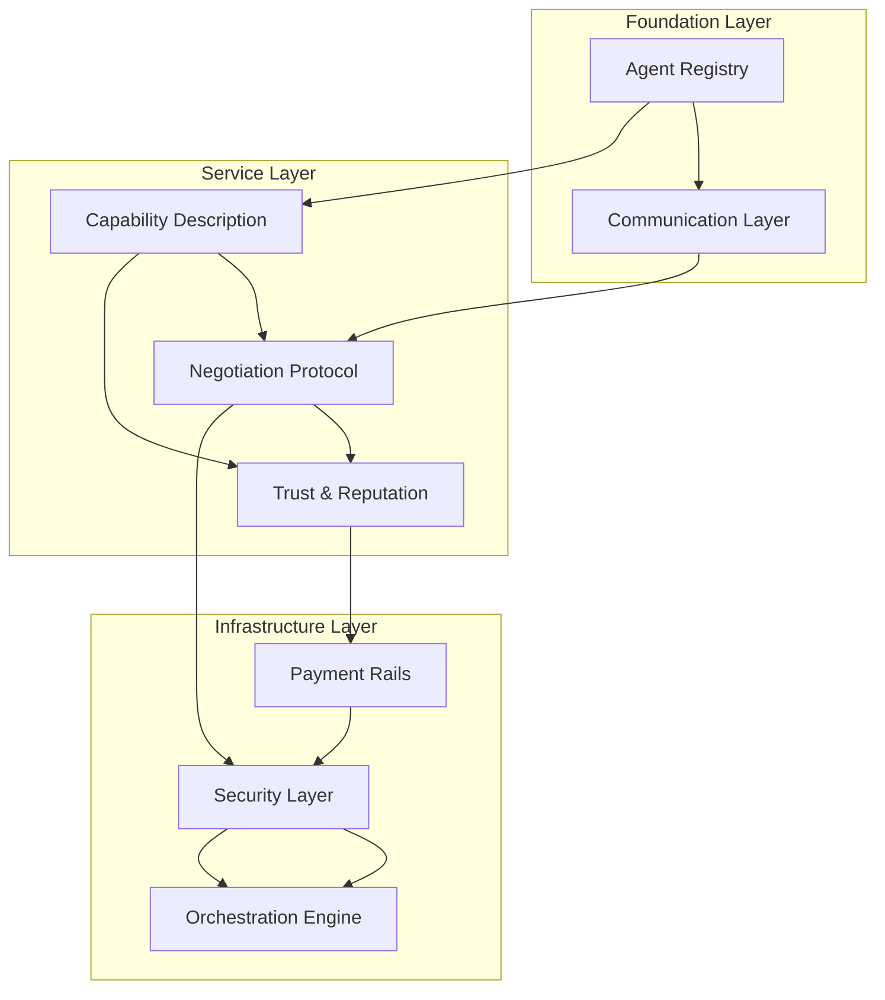

# ⚙️ Componentes Principais do A2A Protocol

> **Os 8 pilares técnicos que fazem o A2A Protocol funcionar**  
> *Cada componente explicado com analogias, exemplos e diagramas práticos*

---

## 🎯 **Introdução**

O A2A Protocol é como uma **cidade moderna** onde agentes de IA vivem, trabalham e colaboram. Assim como uma cidade precisa de infraestrutura (ruas, telefonia, bancos, segurança), o A2A tem **8 componentes essenciais** que tornam a colaboração entre agentes possível, segura e eficiente.

### 🏙️ **A Cidade A2A**

```
         🏙️ CIDADE DOS AGENTES A2A
    ┌─────────────────────────────────────────┐
    │                                         │
    │  🎭 Orchestration Engine                │  ← Prefeito coordenando tudo
    │  ┌─────────────────────────────────────┐ │
    │  │ 🔐 Security Layer                   │ │  ← Polícia e segurança
    │  │ ┌─────────────────────────────────┐ │ │
    │  │ │ 💳 Payment Rails                │ │ │  ← Sistema bancário
    │  │ │ ┌─────────────────────────────┐ │ │ │
    │  │ │ │ ⭐ Trust & Reputation       │ │ │ │  ← Sistema de reputação
    │  │ │ │ ┌─────────────────────────┐ │ │ │ │
    │  │ │ │ │ 🤝 Negotiation Protocol │ │ │ │ │  ← Mesa de negociações
    │  │ │ │ │ ┌─────────────────────┐ │ │ │ │ │
    │  │ │ │ │ │ 📋 CDL (Capabilities) │ │ │ │ │  ← Currículo dos agentes
    │  │ │ │ │ │ ┌─────────────────┐ │ │ │ │ │ │
    │  │ │ │ │ │ │ 📡 Communication│ │ │ │ │ │ │  ← Telefonia e internet
    │  │ │ │ │ │ │ ┌─────────────┐ │ │ │ │ │ │ │
    │  │ │ │ │ │ │ │ 🏪 Registry │ │ │ │ │ │ │ │  ← Lista telefônica
    │  │ │ │ │ │ │ │             │ │ │ │ │ │ │ │
    │  │ │ │ │ │ │ └─────────────┘ │ │ │ │ │ │ │
    │  │ │ │ │ │ └─────────────────┘ │ │ │ │ │ │
    │  │ │ │ │ └─────────────────────┘ │ │ │ │ │
    │  │ │ │ └─────────────────────────┘ │ │ │ │
    │  │ │ └─────────────────────────────┘ │ │ │
    │  │ └─────────────────────────────────┘ │ │
    │  └─────────────────────────────────────┘ │
    └─────────────────────────────────────────┘
```

---

## 📋 **Os 8 Componentes Detalhados**

### **1. 🏪 Agent Registry**
> *"A lista telefônica dos agentes"*

#### **O Que É**
O Agent Registry é um **diretório descentralizado** onde agentes se registram com suas capacidades, endpoints e metadados. É como as Páginas Amarelas para agentes de IA.

#### **Por Que Existe**
- **Descoberta automática**: Agentes encontram outros agentes sem configuração manual
- **Capacidades públicas**: Todos sabem o que cada agente sabe fazer  
- **Endpoints atualizados**: Sempre conhece onde encontrar cada agente
- **Metadata rica**: Versão, status, limitações, etc.

#### **Como Funciona**



#### **Exemplo Prático**
```json
{
  "agent_id": "translator-pro",
  "name": "Professional Translator",
  "version": "2.1.0",
  "endpoint": "https://translator.company.com/api",
  "capabilities": [
    {
      "name": "translate",
      "input_languages": ["pt", "en", "es"],
      "output_languages": ["pt", "en", "es", "fr", "de"],
      "max_chars": 10000
    }
  ],
  "status": "active",
  "last_heartbeat": "2025-01-15T14:30:00Z"
}
```

#### **Analogia do Mundo Real**
É como o **Google Maps para empresas**:
- Você busca "pizzaria perto de mim"
- O sistema retorna opções com endereço, telefone e horários
- Você escolhe e faz contato direto com a pizzaria

---

### **2. 📡 Communication Layer**
> *"As estradas por onde as mensagens trafegam"*

#### **O Que É**
A Communication Layer é a **infraestrutura de transporte** que suporta múltiplos protocolos (HTTP, WebSocket, gRPC) para troca de mensagens entre agentes.

#### **Por Que Existe**
- **Flexibilidade**: Diferentes tipos de comunicação para diferentes cenários
- **Performance**: Protocolo otimizado para cada situação
- **Confiabilidade**: Retry, circuit breakers, load balancing
- **Observabilidade**: Logs, métricas e traces de todas mensagens

#### **Protocolos Suportados**

| Protocolo | Quando Usar | Exemplo |
|-----------|-------------|---------|
| **HTTP/REST** | Requisições simples | "Traduza este texto" |
| **WebSocket** | Comunicação bidirecional | Chat entre agentes |
| **gRPC** | Alta performance | Processamento de dados |

#### **Como Funciona**



#### **Exemplo de Mensagem**
```json
{
  "message_id": "msg_123456",
  "from": "agent_translator",
  "to": "agent_summarizer", 
  "timestamp": "2025-01-15T14:30:00Z",
  "protocol": "http",
  "payload": {
    "task": "summarize",
    "input": "Long text to be summarized...",
    "max_words": 100
  }
}
```

#### **Analogia do Mundo Real**
É como o **sistema de correios moderno**:
- Carta normal (HTTP): Para coisas simples
- Telefone (WebSocket): Para conversas em tempo real
- Malote expressa (gRPC): Para documentos importantes e rápidos

---

### **3. 📋 Capability Description Language (CDL)**
> *"O currículo padronizado dos agentes"*

#### **O Que É**
CDL é uma **linguagem padronizada** para agentes descreverem suas habilidades, inputs/outputs esperados e restrições de forma que outros agentes possam entender automaticamente.

#### **Por Que Existe**
- **Semantic matching**: Agentes encontram exatamente o que precisam
- **Validação automática**: Inputs/outputs são validados automaticamente
- **Versionamento**: Evolução de capacidades sem quebrar compatibilidade
- **Documentação viva**: A capability é sua própria documentação

#### **Estrutura da CDL**

```json
{
  "name": "translate_text",
  "version": "1.2.0",
  "description": "Translates text between supported languages",
  "input_schema": {
    "type": "object",
    "properties": {
      "text": {"type": "string", "maxLength": 10000},
      "from_language": {"type": "string", "enum": ["pt", "en", "es"]},
      "to_language": {"type": "string", "enum": ["pt", "en", "es", "fr"]}
    },
    "required": ["text", "from_language", "to_language"]
  },
  "output_schema": {
    "type": "object", 
    "properties": {
      "translated_text": {"type": "string"},
      "confidence_score": {"type": "number", "minimum": 0, "maximum": 1},
      "detected_language": {"type": "string"}
    }
  },
  "constraints": {
    "max_requests_per_minute": 100,
    "supported_formats": ["plain_text", "html"],
    "pricing": {"cost_per_1000_chars": 0.01}
  }
}
```

#### **Como Matching Funciona**

```mermaid
graph TB
    A[Agente precisa: "translate from pt to en"] 
    A --> M[Matching Engine]
    
    M --> C1[Capability 1: translate pt->en ✅]
    M --> C2[Capability 2: translate en->fr ❌]  
    M --> C3[Capability 3: translate pt->en,fr ✅]
    
    M --> R[Retorna melhores matches]
    R --> A
```

#### **Analogia do Mundo Real**
É como o **LinkedIn para agentes**:
- Perfil padronizado com skills, experiência e limitações
- Sistema de matching para encontrar o profissional certo
- Validação de credenciais automática
- Histórico de work e recomendações

---

### **4. 🤝 Negotiation Protocol**
> *"Como agentes fazem acordos"*

#### **O Que É**
Framework para agentes **negociarem termos** de colaboração automaticamente, incluindo SLAs, custos, prazos e condições de trabalho.

#### **Por Que Existe**
- **Acordos dinâmicos**: Termos se adaptam à situação
- **Otimização automática**: Melhor custo-benefício para ambos
- **SLA garantido**: Compromissos claros de performance
- **Resolução de conflitos**: Mediação automática de disputas

#### **Fluxo de Negociação**



#### **Exemplo de Negociação**

**Proposta Inicial:**
```json
{
  "request_id": "req_789",
  "task": "translate_document",
  "requirements": {
    "document_size": "50_pages",
    "from_language": "pt",
    "to_language": "en",
    "deadline": "2025-01-20T18:00:00Z",
    "quality": "professional"
  },
  "budget": {"max_cost": 100.00, "currency": "USD"}
}
```

**Contra-proposta:**
```json
{
  "request_id": "req_789",
  "status": "counter_offer",
  "terms": {
    "cost": 120.00,
    "currency": "USD", 
    "deadline": "2025-01-21T12:00:00Z",
    "sla": {
      "accuracy": "99%",
      "delivery_guarantee": true,
      "revisions_included": 2
    }
  },
  "reasoning": "Professional quality requires extra time and review"
}
```

#### **Analogia do Mundo Real**
É como **negociação comercial automatizada**:
- Você pede orçamento para reforma (proposta inicial)
- Empreiteiro analisa e faz contra-proposta (preço, prazo)
- Vocês ajustam termos até chegar em acordo
- Contrato é assinado com SLA definido

---

### **5. ⭐ Trust & Reputation System**
> *"O sistema de avaliação dos agentes"*

#### **O Que É**
Sistema de **pontuação baseado em histórico** de interações para estabelecer confiança entre agentes, similar ao sistema de rating do Uber ou avaliações do MercadoLivre.

#### **Por Que Existe**
- **Qualidade garantida**: Agentes com boa reputação são priorizados
- **Proteção contra maliciosos**: Bad actors são identificados e isolados
- **Incentivos corretos**: Comportamento honesto é recompensado
- **Transparência**: Histórico público de performance

#### **Como Funciona o Scoring**



#### **Algoritmo de Reputação**

```python
def calculate_reputation(agent_history):
    scores = []
    
    for interaction in agent_history:
        performance_score = (
            interaction.response_time_score * 0.3 +
            interaction.quality_score * 0.4 +  
            interaction.reliability_score * 0.3
        )
        
        # Peso baseado na recência (mais recente = mais importante)
        time_weight = calculate_time_decay(interaction.timestamp)
        scores.append(performance_score * time_weight)
    
    return weighted_average(scores)
```

#### **Exemplo de Profile de Reputação**
```json
{
  "agent_id": "translator_pro",
  "reputation": {
    "overall_score": 4.7,
    "total_interactions": 1247,
    "success_rate": 0.996,
    "average_response_time": "2.3s",
    "categories": {
      "performance": 4.8,
      "reliability": 4.9, 
      "communication": 4.5,
      "pricing": 4.6
    },
    "recent_reviews": [
      {
        "rating": 5.0,
        "comment": "Fast, accurate translation. Exceeded expectations.",
        "timestamp": "2025-01-15T10:30:00Z"
      }
    ]
  }
}
```

#### **Anti-Gaming Mechanisms**
- **Review authenticity**: Apenas interações reais geram reviews
- **Temporal decay**: Reviews antigas têm menos peso
- **Outlier detection**: Anomalias são investigadas
- **Cross-validation**: Múltiplas fontes validam scores

#### **Analogia do Mundo Real**
É como o **sistema de avaliação do Uber**:
- Passageiros avaliam motoristas após cada corrida
- Motoristas com nota baixa são suspensos
- Histórico de avaliações é público e transparente
- Sistema incentiva bom comportamento

---

### **6. 💳 Payment Rails**
> *"O sistema bancário dos agentes"*

#### **O Que É**
Integração com **sistemas de pagamento** para compensação automática por serviços prestados, incluindo micropagamentos, billing e settlement automático.

#### **Por Que Existe**
- **Monetização**: Agentes podem ser comerciais/profissionais
- **Incentivos econômicos**: Qualidade é recompensada financeiramente
- **Automação completa**: Pagamento automático após entrega
- **Transparência**: Todas transações são auditáveis

#### **Fluxo de Pagamento**



#### **Modelos de Pricing**

| Modelo | Quando Usar | Exemplo |
|--------|-------------|---------|
| **Pay-per-use** | Tarefas pontuais | $0.01 por tradução |
| **Subscription** | Uso frequente | $50/mês para unlimited |
| **Performance-based** | Resultados | % do valor economizado |
| **Auction** | Múltiplos provedores | Menor preço ganha |

#### **Exemplo de Payment Contract**
```json
{
  "contract_id": "pay_contract_456",
  "payer": "agent_requestor",
  "payee": "agent_translator", 
  "terms": {
    "amount": 25.50,
    "currency": "USD",
    "payment_method": "crypto_usdc",
    "escrow_enabled": true,
    "auto_release_conditions": {
      "on_delivery": true,
      "quality_threshold": 0.9,
      "timeout_hours": 24
    }
  },
  "status": "funds_escrowed",
  "created_at": "2025-01-15T14:00:00Z"
}
```

#### **Multi-Currency Support**
- **Fiat currencies**: USD, EUR, BRL
- **Cryptocurrencies**: USDC, ETH, BTC  
- **Platform tokens**: Credits, points
- **Exchange rates**: Real-time conversion

#### **Analogia do Mundo Real**
É como o **sistema de pagamento do Uber**:
- Preço calculado automaticamente
- Cobrança automática após serviço
- Múltiplas formas de pagamento
- Receipt detalhado da transação

---

### **7. 🔐 Security Layer**
> *"A polícia e segurança da cidade"*

#### **O Que É**
**Autenticação mútua, criptografia end-to-end** e verificação de integridade de mensagens para garantir que toda comunicação seja segura e confiável.

#### **Por Que Existe**
- **Zero trust**: Nenhum agente é trusted por default
- **Confidencialidade**: Mensagens são privadas
- **Integridade**: Mensagens não são alteradas
- **Autenticação**: Garantia de identidade dos agentes
- **Auditoria**: Log completo para compliance

#### **Camadas de Segurança**



#### **Authentication Methods**

| Método | Caso de Uso | Exemplo |
|--------|-------------|---------|
| **mTLS** | Agent-to-agent | Certificados X.509 |
| **OAuth 2.0** | Human-to-agent | Token Bearer |
| **API Keys** | Simple integration | Static keys com scope |
| **JWT** | Session management | Signed tokens |

#### **Exemplo de Secure Handshake**
```json
{
  "handshake_request": {
    "agent_id": "translator_secure",
    "certificate": "-----BEGIN CERTIFICATE-----\nMIIE...",
    "signature": "a1b2c3d4e5f6...",
    "timestamp": "2025-01-15T14:00:00Z",
    "nonce": "random_nonce_12345"
  },
  "encryption": {
    "algorithm": "AES-256-GCM",
    "key_exchange": "ECDH-P256", 
    "session_key": "encrypted_session_key"
  }
}
```

#### **Compliance & Auditing**
- **GDPR**: Privacy by design, right to deletion
- **SOX**: Financial audit trails
- **HIPAA**: Healthcare data protection
- **SOC 2**: Security controls audit

#### **Analogia do Mundo Real**
É como o **sistema de segurança de um banco**:
- Identificação obrigatória (autenticação)
- Cofres blindados (criptografia) 
- Permissões específicas (autorização)
- Câmeras gravando tudo (auditoria)

---

### **8. 🎭 Orchestration Engine**
> *"O prefeito que coordena toda a cidade"*

#### **O Que É**
**Coordena workflows complexos** envolvendo múltiplos agentes, gerenciando dependências, paralelização, falhas e otimização de performance.

#### **Por Que Existe**
- **Workflows complexos**: Tarefas que envolvem múltiplos agentes
- **Otimização**: Melhor sequência e paralelização
- **Fault tolerance**: Recovery automático de falhas
- **Resource management**: Uso eficiente de recursos

#### **Exemplo de Workflow**



#### **Workflow Definition Language**
```yaml
workflow:
  name: "document_processing"
  version: "1.0"
  
  steps:
    - name: "ocr_extraction"
      agent: "ocr_agent"
      input: "${workflow.input.document}"
      timeout: "30s"
      
    - name: "translation" 
      agent: "translator_agent"
      input: "${ocr_extraction.output.text}"
      depends_on: ["ocr_extraction"]
      parallel: true
      
    - name: "summarization"
      agent: "summarizer_agent" 
      input: "${ocr_extraction.output.text}"
      depends_on: ["ocr_extraction"]
      parallel: true
      
    - name: "review_translation"
      agent: "reviewer_agent"
      input: "${translation.output}"
      depends_on: ["translation"]
      
  failure_strategy:
    retry_attempts: 3
    fallback_agents: true
    partial_results: true
```

#### **Features Avançadas**
- **Dynamic scaling**: Agentes são instanciados conforme demanda
- **Circuit breakers**: Falhas em cascata são evitadas
- **Checkpoint/Resume**: Workflows podem ser pausados e retomados
- **A/B Testing**: Múltiplas versões de workflows podem ser testadas

#### **Analogia do Mundo Real**
É como o **diretor de uma orquestra**:
- Coordena músicos (agentes) diferentes  
- Garante que todos toquem no tempo certo
- Adapta se alguém erra ou falha
- Otimiza a performance do conjunto

---

## 🔄 **Como os Componentes Trabalham Juntos**

### **📊 Fluxo Completo de Interação**



### **🎯 Interdependências**



---

## 🎓 **Resumo Executivo**

### **💡 Key Takeaways**

1. **Agent Registry** = Lista telefônica para descoberta
2. **Communication Layer** = Infraestrutura de mensagens
3. **CDL** = Linguagem padronizada de capacidades  
4. **Negotiation Protocol** = Acordos automáticos
5. **Trust & Reputation** = Sistema de avaliação
6. **Payment Rails** = Sistema bancário
7. **Security Layer** = Segurança end-to-end
8. **Orchestration Engine** = Coordenação de workflows

### **🏗️ Analogia Final**
O A2A Protocol é como uma **cidade moderna e inteligente**:
- **Registry** = Lista telefônica
- **Communication** = Infraestrutura (ruas, telefonia, internet)
- **CDL** = Currículos padronizados
- **Negotiation** = Mesa de negociações
- **Trust** = Sistema de reputação (como avaliações online)
- **Payment** = Sistema bancário
- **Security** = Polícia e segurança
- **Orchestration** = Prefeito coordenando tudo

### **➡️ Próximo Passo**
Agora que você conhece os 8 componentes, está pronto para:
- **[Arquitetura](../03-arquitetura/)** - Detalhes técnicos profundos
- **[Prática](../04-pratica/)** - Implementar seu primeiro agente
- **[Casos reais](../05-casos-empresariais/)** - Ver como empresas usam

---

*⚙️ Componentes Principais - Os pilares do protocolo A2A*  
*🏗️ Da descoberta à orquestração, cada peça tem seu papel*  
*🎯 **Sua fundação técnica para dominar A2A Protocol***