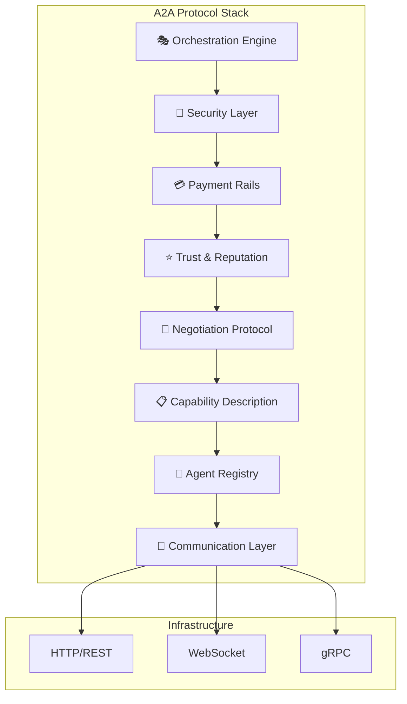

# 🏗️ Arquitetura do A2A Protocol

> **Detalhes técnicos profundos dos 8 componentes que fazem o A2A funcionar**  
> *Para arquitetos de software que precisam entender cada peça do quebra-cabeça*

---

## 🎯 **Objetivo Deste Módulo**

Aqui você vai **mergulhar fundo** nos componentes técnicos do A2A Protocol. Se nos Fundamentos você aprendeu **o que** cada componente faz, aqui você aprenderá **como** cada um funciona internamente, suas interfaces, protocolos e padrões de integração.

### 👥 **Perfil do Público**
- 🏗️ **Arquitetos de software**
- 💻 **Tech leads** e engenheiros seniores  
- 🔧 **DevOps** e engenheiros de infraestrutura
- 📊 **CTOs** e diretores técnicos

### 📚 **Pré-requisitos**
- ✅ [02-fundamentos](../02-fundamentos/) completado
- ✅ Experiência com arquitetura distribuída
- ✅ Conhecimento de protocolos de rede
- ✅ Familiaridade com APIs REST e eventos

---

## 🏛️ **Arquitetura Geral do Sistema**

### **Visão de Alto Nível**



---

## 📋 **Módulos de Arquitetura**

### **1. 🏗️ [Visão Geral](visao-geral.md)**
**O Big Picture**
- Diagrama completo da arquitetura
- Fluxo de dados entre componentes
- Padrões arquiteturais utilizados
- Princípios de design

```
⏱️ Tempo: 45 minutos
🎯 Resultado: Visão sistêmica da arquitetura
```

### **2. 🏪 [Agent Registry](agent-registry.md)**
**Descoberta de Serviços**
- Estrutura de dados do registry
- Algoritmos de descoberta
- Políticas de TTL e cache
- Alta disponibilidade e particionamento

```
⏱️ Tempo: 1 hora
🎯 Resultado: Compreender descoberta de agentes
```

### **3. 📡 [Communication Layer](communication-layer.md)**
**Infraestrutura de Mensagens**
- Protocolos suportados (HTTP, WS, gRPC)
- Message routing e load balancing
- Retry policies e circuit breakers
- Observabilidade e métricas

```
⏱️ Tempo: 1.5 horas
🎯 Resultado: Dominar comunicação entre agentes
```

### **4. 📋 [Capability Description](capability-description.md)**
**CDL - Linguagem de Capacidades**
- Schema JSON da CDL
- Semantic matching algorithms
- Versionamento de capacidades
- Validação e compliance

```
⏱️ Tempo: 1 hora
🎯 Resultado: Estruturar capacidades de agentes
```

### **5. 🤝 [Negotiation Protocol](negotiation-protocol.md)**
**Negociação Automática**
- State machine de negociação
- Algoritmos de matching
- SLA negotiation patterns
- Conflict resolution strategies

```
⏱️ Tempo: 1.5 horas
🎯 Resultado: Implementar negociação automática
```

### **6. ⭐ [Trust & Reputation](trust-reputation.md)**
**Sistema de Confiança**
- Algoritmos de scoring
- Reputation decay models
- Anti-gaming mechanisms
- Federated trust networks

```
⏱️ Tempo: 1 hora
🎯 Resultado: Construir sistema de confiança
```

### **7. 💳 [Payment Rails](payment-rails.md)**
**Sistema de Pagamentos**
- Micropayment architecture
- Blockchain integration
- Accounting and billing
- Multi-currency support

```
⏱️ Tempo: 1 hora
🎯 Resultado: Monetizar interações entre agentes
```

### **8. 🔐 [Security Layer](security-layer.md)**
**Segurança End-to-End**
- Authentication & authorization
- Encryption standards
- Key management
- Threat modeling

```
⏱️ Tempo: 1.5 horas
🎯 Resultado: Garantir segurança do sistema
```

### **9. 🎭 [Orchestration Engine](orchestration-engine.md)**
**Coordenação de Workflows**
- Workflow definition language
- Dependency resolution
- Failure handling strategies
- Performance optimization

```
⏱️ Tempo: 2 horas
🎯 Resultado: Orquestrar workflows complexos
```

---

## 🎓 **Trilhas de Estudo**

### **🚀 Trilha Arquiteto (3-5 dias)**
```
visao-geral.md → agent-registry.md → communication-layer.md 
     ↓
security-layer.md → orchestration-engine.md
```
**Foco**: Decisões arquiteturais de alto nível

### **🔧 Trilha Implementação (1 semana)**
```
Todos os módulos em ordem sequencial
```
**Foco**: Detalhes técnicos para implementação

### **🏢 Trilha Empresarial (2 dias)**
```
visao-geral.md → trust-reputation.md → payment-rails.md
```
**Foco**: Aspectos de negócio e governança

---

## 🔍 **Decisões Arquiteturais**

### **🎯 Princípios de Design**

#### **1. Loose Coupling**
- Agentes se comunicam via interfaces padronizadas
- Não há dependência direta entre agentes
- Registry permite descoberta dinâmica

#### **2. High Scalability**
- Architecture stateless onde possível
- Horizontal scaling através de load balancers
- Partitioning strategies para registry

#### **3. Fault Tolerance**
- Circuit breakers em comunicação
- Graceful degradation de funcionalidades
- Self-healing através de health checks

#### **4. Security by Design**
- Zero trust networking
- End-to-end encryption
- Principle of least privilege

---

## 📊 **Padrões Arquiteturais**

### **🏛️ Padrões Utilizados**

| Padrão | Componente | Propósito |
|--------|------------|-----------|
| **Service Registry** | Agent Registry | Descoberta de serviços |
| **API Gateway** | Communication Layer | Roteamento e políticas |
| **Circuit Breaker** | Communication Layer | Tolerância a falhas |
| **CQRS** | Orchestration Engine | Separação de comandos/consultas |
| **Event Sourcing** | Trust System | Auditoria de reputação |
| **Saga Pattern** | Negotiation Protocol | Transações distribuídas |

### **📈 Trade-offs de Design**

#### **Consistência vs Disponibilidade**
- **Escolha**: Disponibilidade (AP no CAP theorem)
- **Razão**: Agentes precisam funcionar mesmo com registry parcialmente indisponível
- **Implicação**: Eventual consistency no registry

#### **Performance vs Segurança**
- **Escolha**: Segurança prioritária
- **Razão**: Trust é fundamental em sistemas multi-agente
- **Implicação**: Overhead de autenticação e criptografia

#### **Flexibilidade vs Simplicidade**
- **Escolha**: Flexibilidade controlada
- **Razão**: Suporte a casos de uso diversos
- **Implicação**: Complexity gerenciada através de abstrações

---

## 🔧 **Especificações Técnicas**

### **📋 Interfaces Principais**

#### **Agent Registry API**
```yaml
/agents:
  POST: Registrar novo agente
  GET: Listar agentes disponíveis  
  
/agents/{id}:
  GET: Detalhes do agente
  PUT: Atualizar capabilities
  DELETE: Remover agente
  
/agents/search:
  POST: Buscar agentes por capabilities
```

#### **Communication Layer**
```yaml
Protocolos suportados:
  - HTTP/REST: Requisições síncronas
  - WebSocket: Comunicação bidirecional
  - gRPC: High-performance RPC
  
Message Format:
  - JSON: Payload padrão
  - Protocol Buffers: Para gRPC
  - MessagePack: Otimização opcional
```

---

## 🛡️ **Considerações de Segurança**

### **🔐 Security Model**

#### **Autenticação**
- **mTLS**: Mutual TLS para agentes
- **OAuth 2.0**: Para clients externos
- **JWT**: Tokens para sessões

#### **Autorização**
- **RBAC**: Role-based access control
- **ABAC**: Attribute-based para casos complexos
- **Capability-based**: Segurança por design

#### **Criptografia**
- **At Rest**: AES-256 para dados persistidos
- **In Transit**: TLS 1.3 obrigatório
- **Key Management**: HSM para chaves críticas

---

## 📈 **Performance e Observabilidade**

### **📊 Métricas Chave**

#### **Latência**
- Registry lookup: < 10ms P99
- Message routing: < 5ms P99  
- End-to-end: < 100ms P99

#### **Throughput**
- Registry: 10K+ queries/second
- Communication: 100K+ messages/second
- Negotiation: 1K+ agreements/second

#### **Observabilidade**
```yaml
Logs:
  - Structured logging (JSON)
  - Correlation IDs
  - Security audit trail
  
Métricas:
  - Prometheus format
  - Custom metrics per component
  - SLA tracking
  
Tracing:
  - OpenTelemetry
  - Distributed tracing
  - Performance profiling
```

---

## ➡️ **Implementação Prática**

### **🚀 Pronto Para Implementar?**

Após dominar a arquitetura:

#### **Opção 1: HelloWorld Avançado**
**➡️ [04-pratica/](../04-pratica/)** - Implemente com arquitetura real

#### **Opção 2: Casos Empresariais**
**➡️ [05-casos-empresariais/](../05-casos-empresariais/)** - Veja SAP e outros

#### **Opção 3: SDKs Específicos**
**➡️ [06-implementacoes/](../06-implementacoes/)** - Escolha sua linguagem

---

## 📚 **Recursos Adicionais**

### **📖 Leitura Técnica**
- [ADR (Architecture Decision Records)](adrs/)
- [Performance benchmarks](benchmarks/)
- [Security analysis](security-analysis/)

### **🛠️ Ferramentas**
- [Architecture diagrams](diagramas/)
- [API specifications](api-specs/)
- [Reference implementations](../06-implementacoes/)

---

## 🎯 **Resumo Executivo**

### **💡 O Que Você Dominou**
Após este módulo, você conhece **intimamente**:
- A arquitetura interna de cada componente
- Como os componentes se integram
- Trade-offs e decisões de design
- Aspectos de performance e segurança

### **⚡ Aplicação Prática**
Este conhecimento permite:
- **Projetar** sistemas A2A para produção
- **Avaliar** soluções existentes
- **Tomar decisões** arquiteturais informadas
- **Comunicar** com stakeholders técnicos

### **🎓 Próximo Nível**
Você está pronto para:
- Implementar agentes de nível produção
- Integrar sistemas empresariais reais
- Liderar iniciativas A2A na sua organização

---

*🏗️ Módulo Arquitetura - Os blueprints do protocolo A2A*  
*⚙️ Da visão geral aos detalhes técnicos, da teoria à implementação*  
*🎯 **Sua expertise técnica para dominar A2A***